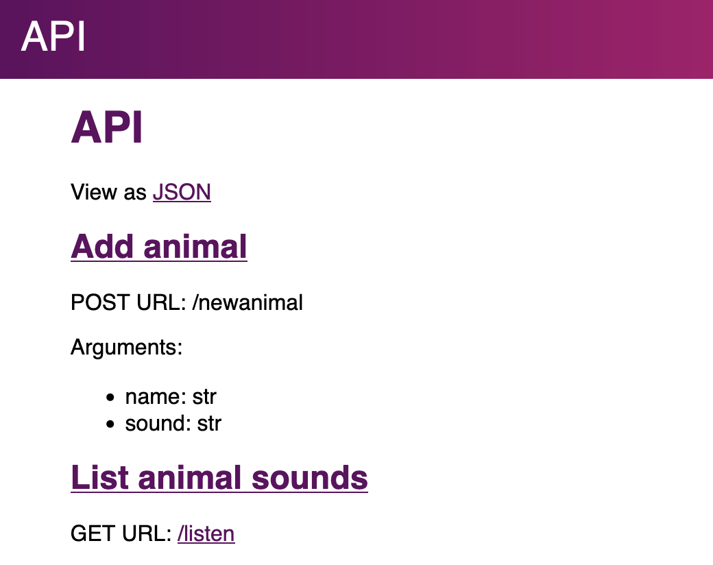

Getting started
===============

Creating an app
---------------

Banjo can be installed with ``pip install django-banjo``.

To write a Banjo app, create a folder called ``app``, define models in
``models.py`` and define views in ``views.py``. Here’s a simple example.

Models
~~~~~~

First, we define our models. Banjo provides five field types:

-  ``BooleanField`` (``True``, ``False``)
-  ``IntegerField`` (``1``, ``-102``)
-  ``FloatField`` (``0.045``, ``11.5``)
-  ``StringField`` (``"alligator"``, ``"hazelnut"``)
-  ``ForeignKey`` (An instance of another model)

Create a Model for each object your app will interact with. 

::

   # app/models.py
   from banjo.models import Model, StringField

   class Animal(Model):
       name = StringField()
       sound = StringField()

Views
~~~~~

Next we define our views. Each view is a function which receives a dict
(called ``params`` in the example below) and which must return a dict.
Use the ``banjo.urls.route_get`` and ``banjo.urls.route_post``
decorators to route URLs to your view functions.

::

   # app/views.py
   from banjo.urls import route_get, route_post
   from app.models import Animal

   @route_post('newanimal', args={'name': str, 'sound': str})
   def add_animal(params):
       animal = Animal.from_dict(params)
       animal.save()
       return animal.to_dict()

   @route_get('listen')
   def list_animal_sounds(params):
       sounds = []
       for animal in Animal.objects.all():
           sounds.append('{} says {}'.format(animal.name, animal.sound))     
       return {'sounds': sounds}

Some views, such as “newanimal,” require arguments. When a view requires
arguments, pass an ``args`` dict to the decorator to specify the
expected names and types of arguments. Argument types must be ``str``,
``bool``, ``int``, or ``float``.

HTTP errors
~~~~~~~~~~~

If something goes wrong and it’s the client’s fault, you can raise an
error. For example, you might add another view to ``app/views.py``:

::

   from banjo.http import Forbidden

   @route_get('secrets')
   def do_not_show_the_secrets(params):
       raise Forbidden("Nice try.")

Again, from the command line:

::

   $ http GET localhost:5000/secrets
   HTTP/1.1 403 Forbidden

   {
       "error": "Nice try."
   }

The following errors are available in ``banjo.http``:

-  ``BadRequest`` (400)
-  ``Forbidden`` (403)
-  ``NotFound`` (404)
-  ``NotAllowed`` (405)
-  ``ImATeapot`` (418)

Running the app
---------------

Now you can run ``banjo`` from the directory containing the ``app``
folder and the server will start. Use the ``--port`` command to serve
from a custom port; the default is 5000. You can also pass ``--debug``, which 
launches the app in Django's debug mode.

Banjo provides a visual API browser at ``/api``.

   Screenshot of visual API browser

Here is an example of interacting with this app using the `httpie <https://httpie.io/cli>`_
command-line utility:

::

   $ http localhost:5000/newanimal name=elehpant sound=pffffftttttt

   { 
     "id": 1,
     "name": "elephant",
     "sound": "pffffftttttt"
   }

   $ http localhost:5000/newanimal name=squirrel sound=chcheee

   { 
     "id": 2,
     "name": "squirrel",
     "sound": "chcheee"
   }

   $ http localhost:5000/listen

   {
     "sounds": [
       "elephant says pffffftttttt",
       "squirrel says chcheee"
     ]
   }

Shell
-----

You can also interact with your app’s models from a Python shell. Just
pass the ``--shell`` argument to banjo:

::

   $ banjo --shell
   > Animal.objects.count()
   2
